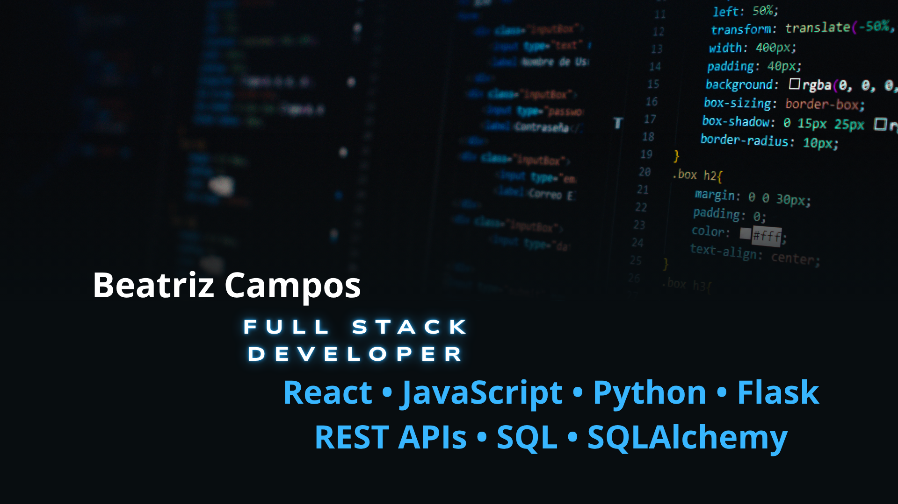

  

# 👋 Hola, soy Beatriz Campos

## 💻 Full Stack Developer

Desarrollo aplicaciones web completas, participando tanto en el **frontend** como en el **backend**, utilizando **JavaScript, React, Python, Flask y SQL**.

He desarrollado proyectos Full Stack en los que he diseñado interfaces modernas y responsivas, implementado **APIs REST**, trabajado con **bases de datos mediante SQLAlchemy** y construido aplicaciones escalables.

Además, he complementado mi formación con especialización en **Full Stack with AI** y **Desarrollo con IA**, incorporando herramientas de Inteligencia Artificial para optimizar el desarrollo y mejorar la productividad.

Me considero una persona comprometida, con capacidad de adaptación, orientada al trabajo en equipo y enfocada en crear soluciones funcionales que ofrezcan una excelente experiencia de usuario.

---

## 🚀 Tecnologías

* JavaScript
* React
* Python
* Flask
* HTML5
* CSS3
* SQL
* SQLAlchemy
* Git
* GitHub
* REST APIs

---

## 📌 Proyectos destacados

### ⚽ GoalHub

Aplicación Full Stack orientada a aficionados al fútbol con autenticación de usuarios, estadísticas, comentarios, tienda y sistema de predicciones.

### 💆 Web Salón de Masajes

Landing page moderna y responsive diseñada para un centro de bienestar, con un enfoque en la experiencia de usuario y el diseño visual.

### 🌌 Star Wars Blog

Aplicación desarrollada con React que consume una API externa, con navegación dinámica y gestión de favoritos.

### 📇 Contact List

Aplicación CRUD desarrollada con React, Flask y API REST para la gestión de contactos.

---

## 📫 Contacto

📍 Barcelona, España

💼 LinkedIn
[www.linkedin.com/in/bea-campos-5670a633b](http://www.linkedin.com/in/bea-campos-5670a633b)

📧 Email
[beatriz24bcn@hotmail.com](mailto:beatriz24bcn@hotmail.com)
